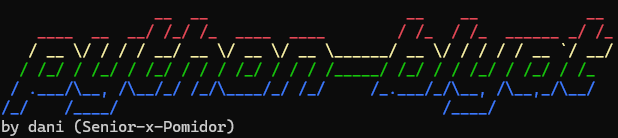

# python-blyat

*A delightful collection of handpicked terminal games made with Python.*

## 🎮 Game Collection

**python-blyat** is a curated selection of classic games, all connected through a simple, user-friendly terminal menu. The collection includes:

- 🚢 **Battleship** – A turn-based naval guessing game  
- 🪢 **Hangman** – The classic word-guessing challenge  
- 🎯 **Tic Tac Toe** – A strategic 2-player grid game
- 🃏 **Blackjack** – A fast-paced card showdown
- 🔢 **2048** – The popular number puzzle

## 💰 Easy Money Management System

**python-blyat** comes with a built-in, lightweight money management system to track your in-game currency and bets.

## 🚀 How to Start

Make sure you have **Python** installed. Then, launch the main menu from your terminal:


```bash
python3 games.py
```
## ⚙️ Win10 Output fix

- By default, PowerShell (and the legacy Windows Console) does not interpret ANSI escape sequences (“VT100”).
- Follow the steps below to manually enable color escape codes (`\033[…m`) on Windows 10/11.
- Note: If you don’t perform this, the ANSI color-code sequences will not be interpreted and will instead be displayed as raw text.

### 1. Via the Registry (Manual)

1. **Open Registry Editor**  

   – Press `Win + R`, type `regedit` and press **Enter**.  
   – Confirm the UAC prompt.

2. **Navigate to the Key** 

   – and open a new one.  
   – ANSI escape sequences (e.g., `\033[1;31m…\033[0m`) should now render in color.

### 2. Via a PowerShell Command

If you prefer scripting the registry change, run:

```powershell
Set-ItemProperty -Path HKCU:\Console -Name VirtualTerminalLevel -Value 1 -Type DWord
```

